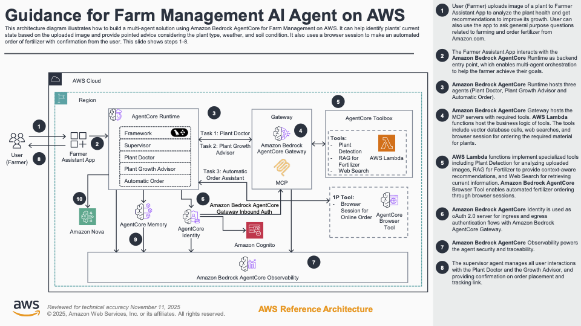
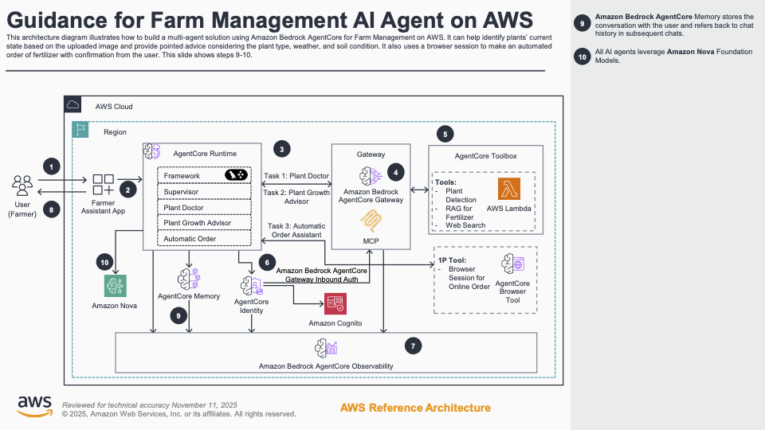

# Guidance for Farm Management AI Agent on AWS

## Table of Contents

1. [Overview](#overview)
2. [Architecture](#architecture)
3. [Prerequisites](#prerequisites)
4. [Deployment Steps](#deployment-steps)
5. [Deployment Validation](#deployment-validation)
6. [Running the Guidance](#running-the-guidance)
7. [Cleanup](#cleanup)
8. [FAQ, Known Issues](#faq-known-issues)
9. [Authors](#authors)

---

## Overview

This guidance demonstrates how to build an AI-powered farm management assistant using **Amazon Bedrock AgentCore** and **Amazon Nova models**, helping farmers optimize crop health and streamline operations. By combining instant plant disease diagnostics, personalized growing recommendations, and automated supply ordering capabilities, farmers can make data-driven decisions directly from the field.

### Key Benefits

- **Optimize Crop Management**: Deploy specialized AI agents that analyze plant health and provide tailored recommendations. Farmers can upload images to receive immediate diagnostics and growth advice based on plant type, weather conditions, and real-time information.

- **Streamline Farming Operations**: Automate routine agricultural tasks through a multi-agent solution that handles plant diagnostics, growth recommendations, and supply ordering. Focus on implementing expert advice while the system manages the complexity of coordinating multiple specialized AI agents.

- **Enhance Decision-Making Capabilities**: Access contextual farming insights through specialized tools including image analysis, knowledge retrieval, and real-time web searches. Make informed decisions with AI-powered recommendations that consider your specific agricultural conditions and requirements.

### Solution Features

- **Plant Disease Detection**: Instant diagnosis using Amazon Nova's multimodal capabilities to analyze plant images and identify health issues
- **Personalized Care Recommendations**: AI-driven advice tailored to specific plant types, growth stages, and environmental conditions
- **Weather Integration**: Real-time weather data to provide context-aware farming recommendations
- **Web Search Capability**: Access to latest agricultural research and best practices (Tavily API with Bedrock fallback)
- **Automated Ordering**: Browser automation for fertilizer and supply ordering (Nova-Act integration)
- **Memory-Enabled Conversations**: Track plant health over time with conversation history and analysis records
- **Secure Access**: Amazon Cognito authentication with user management

---

## Architecture

### Architecture Diagram

The solution uses a serverless, multi-tier architecture powered by Amazon Bedrock AgentCore. The architecture is illustrated in two complementary diagrams showing the complete system flow:

#### Part 1: User Interaction and Tool Integration (Steps 1-8)



**Flow Steps 1-8:**

1. **User (Farmer)** - Uploads image of a plant to Farmer Assistant App to analyze the plant health and get recommendations to improve its growth. Can also ask general purpose questions about farming and order fertilizer from Amazon.com

2. **Farmer Assistant App** - The web application interacts with the Amazon Bedrock AWS SDK for Python (boto3) backend integration to help the farmer achieve their goals

3. **Amazon Bedrock AgentCore Runtime** - Hosts three agents with specialized capabilities:
   - **Framework Component**: Supervisor orchestrates the workflow
   - **Task 1: Plant Doctor** - Analyzes plant health and diagnoses issues
   - **Task 2: Plant Growth Advisor** - Provides personalized care recommendations
   - **Task 3: Automatic Order Assistant** - Handles fertilizer ordering automation

4. **Amazon Bedrock AgentCore Gateway** - Hosts the MCP servers and routes requests to specialized tools. The MCP (Model Context Protocol) enables seamless tool integration and business logic execution

5. **AgentCore Toolbox (AWS Lambda)** - Collection of specialized tools implemented as Lambda functions:
   - **Plant Detection** - Image analysis for plant identification
   - **RAG for Fertilizer** - Provides context-aware fertilizer recommendations
   - **Web Search** - Access to latest agricultural research and information
   - **1P Tool**: Browser Session for Online Order - Enables automated fertilizer ordering through browser sessions

6. **Amazon Bedrock AgentCore Identity** - Used as OAuth 2.0 server for secure authentication flows with Amazon Bedrock AgentCore Gateway

7. **Amazon Bedrock AgentCore Observability** - Powers the agent security and traceability with comprehensive monitoring and logging

8. **Supervisor Agent** - Manages all user interactions with the Plant Doctor and the Growth Advisor, providing confirmation on order placement and tracking

#### Part 2: Memory and AI Model Integration (Steps 9-10)



**Flow Steps 9-10:**

9. **Amazon Bedrock AgentCore Memory** - Stores the conversation with the user and refers back to chat history in subsequent chats, enabling contextual continuity across sessions

10. **Amazon Nova Foundation Models** - All AI agents leverage Amazon Nova models for:
    - Vision analysis (plant image processing)
    - Natural language understanding and generation
    - Multi-modal reasoning combining image and text inputs

### Component Description

**Frontend Layer:**
- **AWS WAF**: Web Application Firewall with AWS Managed Rules protecting against common threats
- **Amazon CloudFront**: Global CDN with HTTPS termination, caching, and DDoS protection
- **Application Load Balancer**: Distributes traffic to ECS containers in private subnets

**Application Layer:**
- **Amazon ECS Fargate**: Runs Flask web application in containers (serverless compute)
- **Amazon Cognito**: Handles user authentication and authorization with hosted UI
- **Amazon ECR**: Stores Docker container images

**AI Agent Layer:**
- **Amazon Bedrock AgentCore Runtime**: Orchestrates multi-agent workflows
- **AgentCore Gateway**: Routes requests to specialized Lambda functions
- **AgentCore Memory Store**: Maintains conversation history and analysis records

**Specialized Agent Functions:**
- **Plant Detection Lambda**: Analyzes plant images using Amazon Nova vision model
- **Plant Care Lambda**: Provides growing recommendations using Amazon Nova
- **Weather Forecast Lambda**: Fetches real-time weather data from Open-Meteo API
- **Web Search Lambda**: General web search with Tavily/Bedrock fallback
- **Plant Web Search Lambda**: Specialized agricultural research search

**Supporting Services:**
- **AWS Secrets Manager**: Securely stores API keys (Tavily, Nova-Act)
- **AWS Systems Manager Parameter Store**: Stores configuration parameters
- **Amazon S3**: Stores Lambda deployment packages and static assets
- **AWS KMS**: Encrypts sensitive data at rest

---

## Prerequisites

### AWS Account Requirements

1. **AWS Account**: Sign up for an AWS account [here](https://aws.amazon.com/resources/create-account/) if you don't have one

2. **AWS CLI**: Install and configure the AWS CLI following instructions [here](https://docs.aws.amazon.com/cli/latest/userguide/getting-started-install.html)

### Technical Requirements

1. **Operating System**: Linux or macOS (Windows users can use WSL or Git Bash)

2. **Required Tools**:
   - Git (for cloning the repository)
   - Bash shell (for running deployment script)
   - Python 3.9+ (for packaging Lambda functions)
   - AWS CLI v2 (configured with appropriate credentials)

3. **AWS Permissions**: Your IAM user/role must have permissions to create:
   - CloudFormation stacks
   - Lambda functions and layers
   - IAM roles and policies
   - S3 buckets
   - Secrets Manager secrets
   - ECS clusters and services
   - AgentCore
   - Cognito user pools
   - CloudFront distributions
   - Application Load Balancers

### Optional API Keys

1. **Tavily API Key** :
   - Sign up at [https://tavily.com](https://tavily.com)
   - Used for enhanced web search functionality
   - If not provided, the app will use Amazon Bedrock for web search as fallback

2. **Nova-Act API Key** :
   - Required only for automated fertilizer ordering feature
   - If not provided, plant analysis and care advice will still work fully

### Supported Regions

⚠️ **IMPORTANT: This solution MUST be deployed in us-east-1**

**Note**: While some services (Lambda, ECS, Bedrock) technically support other regions, this solution deploys everything in us-east-1 to ensure WAF compatibility and simplified networking.

---

## Deployment Steps

⚠️ **IMPORTANT**: Before deploying, ensure you understand the regional requirements:
- This solution **MUST** be deployed in `us-east-1` (US East N. Virginia)
- The deployment script automatically uses `us-east-1`

### Step 1: Clone the Repository

```bash
git clone <repository-url>
cd nova-agentcore-plant-advisor
```

### Step 2: Review Configuration

The deployment uses a single script that handles all setup. Review the project structure:

```
nova-agentcore-plant-advisor/
├── deploy.sh                        # Main deployment script
├── plant-advisor-main.yaml          # Master CloudFormation template
├── plant-advisor-backend.yaml       # Backend services template
├── plant-advisor-ui.yaml            # UI deployment template
├── Lambda/                          # Lambda function source code
│   ├── plant_detection.py          # Plant image analysis
│   ├── plant_care.py               # Care recommendations
│   ├── weather_forecast.py         # Weather integration
│   ├── websearch.py                # General web search
│   ├── plant_websearch.py          # Plant-specific search
│   └── nova_config.py              # Nova model configuration
├── layers/.                        # Lambda layers
│   ├── bedrock-agentcore           # AgentCore Starter Toolkit
│   └── http-utils.                 # HTTP utilities
└── ui/                             # Flask web application
    ├── app_auth.py                 # Main Flask app
    ├── Dockerfile                  # Container configuration
    └── templates/                  # HTML, CSS, JS files
```

### Step 3: Run Deployment Script

Make the deployment script executable and run it:

```bash
chmod +x deploy.sh
./deploy.sh
```

The script will:
1. ✅ Validate AWS credentials and region
2. 📦 Create S3 bucket for deployment artifacts
3. 🔨 Package Lambda functions into ZIP files
4. ⬆️ Upload packages, layers, and templates to S3
5. 🔑 Prompt for API keys:
   - **Tavily API Key** (optional - press Enter to skip)
   - **Nova-Act API Key** (optional - press Enter to skip)
6. 🚀 Deploy CloudFormation stack with nested stacks
7. ⏳ Wait for deployment completion (15-20 minutes)

**Example Deployment Output:**
```
🚀 Starting Lambda deployment process...
🔐 Validating AWS credentials...
✅ AWS credentials validated
   Account: 123456789012
   Identity: arn:aws:iam::123456789012:user/admin
   Region: us-east-1

🪣 Checking S3 bucket: plant-advisor-lambda-code-a1b2c3d4
✅ S3 bucket created successfully

📦 Packaging Lambda functions...
✅ Packaged plant_detection.zip
✅ Packaged plant_care.zip
[...]

⬆️ Uploading Lambda packages to S3...
⬆️ Uploading CloudFormation templates to S3...

🔧 Deployment Parameters Setup...

Nova-Act API Key (optional, press Enter to skip): [hidden]
Tavily API Key (optional, press Enter to skip): [hidden]

🚀 Deploying CloudFormation stack...
[CloudFormation progress logs...]

✅ Deployment completed successfully!
```

### Step 4: Monitor Deployment

While the deployment is in progress, you can monitor it via:

**AWS Console:**
1. Go to [CloudFormation Console](https://console.aws.amazon.com/cloudformation/)
2. Find stack named `plant-advisor-main`
3. Monitor the **Events** tab for progress
4. Check the **Outputs** tab after completion

**AWS CLI:**
```bash
# Watch deployment progress
aws cloudformation describe-stack-events \
  --stack-name plant-advisor-main \
  --query 'StackEvents[0:10].[Timestamp,ResourceStatus,ResourceType,LogicalResourceId]' \
  --output table

# Check stack status
aws cloudformation describe-stacks \
  --stack-name plant-advisor-main \
  --query 'Stacks[0].StackStatus' \
  --output text
```

### Step 5: Retrieve Access Information

After successful deployment, retrieve the application URL and credentials:

```bash
# Get CloudFormation outputs
aws cloudformation describe-stacks \
  --stack-name plant-advisor-main \
  --query 'Stacks[0].Outputs' \
  --output table
```

You will see outputs including:
- **WebsiteURL**: The CloudFront URL to access the application
- **Username**: Default username 
- **Password**: Default password

---

## Deployment Validation

### Step 1: Verify CloudFormation Stacks

Check that all stacks are in `CREATE_COMPLETE` status:

```bash
# List all plant-advisor stacks
aws cloudformation list-stacks \
  --stack-status-filter CREATE_COMPLETE \
  --query 'StackSummaries[?contains(StackName, `plant-advisor`)].{Name:StackName,Status:StackStatus}' \
  --output table
```

Expected stacks:
- `plant-advisor-main` (Master stack)
- `plant-advisor-main-PlantAdvisorBackend-*` (Backend stack)
- `plant-advisor-main-PlantAdvisorUI-*` (UI stack)

### Step 2: Verify Lambda Functions

Confirm Lambda functions are deployed and ready:

```bash
# List plant advisor Lambda functions
aws lambda list-functions \
  --query 'Functions[?contains(FunctionName, `plant-advisor`)].{Name:FunctionName,Runtime:Runtime,State:State}' \
  --output table
```

Expected functions:
- `plant-advisor-main-*-plant-det` (Plant Detection)
- `plant-advisor-main-*-care` (Plant Care)
- `plant-advisor-main-*-weather` (Weather Forecast)
- `plant-advisor-main-*-ws` (Web Search)
- `plant-advisor-main-*-pws` (Plant Web Search)
- Custom resource functions (gateway, runtime, etc.)

### Step 3: Verify Bedrock AgentCore Resources

Check AgentCore runtime and gateway are created:

```bash
# List AgentCore runtimes
aws bedrock-agentcore-control list-agent-runtimes \
  --region us-east-1 \
  --query 'agentRuntimes[?contains(agentRuntimeName, plant)].{Name:agentRuntimeName,Status:status,ARN:agentRuntimeArn}' \
  --output table

# List AgentCore gateways
aws bedrock-agentcore-control list-gateways \
  --region us-east-1 \
  --query 'items[?contains(name, Plant)].{Name:name,Status:status}' \
  --output table
```

### Step 4: Verify ECS Service

Check that the UI container is running:

```bash
# List ECS clusters
aws ecs list-clusters \
  --query 'clusterArns[?contains(@, `plant`)]' \
  --output text

# Get cluster name and check tasks
CLUSTER_ARN=$(aws ecs list-clusters --query 'clusterArns[?contains(@, `plant`)]' --output text)
aws ecs list-tasks --cluster $CLUSTER_ARN --desired-status RUNNING
```

### Step 5: Test Health Check Endpoint

Test the application health check:

```bash
# Get the CloudFront URL from CloudFormation outputs
WEBSITE_URL=$(aws cloudformation describe-stacks \
  --stack-name plant-advisor-main \
  --query 'Stacks[0].Outputs[?OutputKey==`WebsiteURL`].OutputValue' \
  --output text)

# Test health endpoint
curl -s "${WEBSITE_URL}/health" | jq .
```

Expected response:
```json
{
  "status": "healthy",
  "runtime_configured": true,
  "runtime_arn": "arn:aws:bedrock-agentcore:us-east-1:...",
  "region": "us-east-1",
  "account_id": "123456789012",
  "timestamp": "2024-12-10T10:00:00"
}
```

### Step 6: Verify Cognito User Pool

Check Cognito user pool configuration:

```bash
# List Cognito user pools
aws cognito-idp list-user-pools --max-results 10 \
  --query 'UserPools[?contains(Name, `plant`)].{Name:Name,Id:Id}' \
  --output table

# Get user pool details
USER_POOL_ID=$(aws cognito-idp list-user-pools --max-results 10 \
  --query 'UserPools[?contains(Name, `plant`)].Id' --output text)
aws cognito-idp describe-user-pool --user-pool-id $USER_POOL_ID
```

### Common Validation Issues

| Issue | Verification | Solution |
|-------|-------------|----------|
| CloudFormation stack failed | Check Events tab for error | Review IAM permissions, check service quotas |
| Lambda function not created | Check CloudWatch Logs | Verify S3 bucket access, check ZIP file uploads |
| Runtime not configured | Check AgentCore console | Verify Bedrock model access, check IAM roles |
| ECS task not running | Check ECS console task logs | Review task definition, check ECR image availability |
| Health check fails | Test endpoint directly | Check security groups, verify ALB target health |

---

## Running the Guidance

### Accessing the Application

1. **Get the CloudFront URL:**
   ```bash
   aws cloudformation describe-stacks \
     --stack-name plant-advisor-main \
     --query 'Stacks[0].Outputs[?OutputKey==`WebsiteURL`].OutputValue' \
     --output text
   ```

2. **Open the URL in your browser:**
   - The URL will be in the format: `https://d1234567890abc.cloudfront.net`
   - You'll be redirected to the landing page

3. **Log in with Cognito credentials:**
   - Click "Sign In" on the landing page
   - Enter the username and temporary password from CloudFormation outputs
   - You'll be prompted to change your password on first login
   - Complete the password change and proceed to the application

### Using the Plant Analyzer

#### 1. Analyze Plant Health

**Upload a plant image for instant analysis:**

1. Click the **"🌱 Upload an image for analysis"** button
2. Select or drag-drop an image file (JPG, PNG, GIF up to 16MB)
3. Click **"Upload & Analyze"**
4. Wait for the AI to process the image (10-30 seconds)

**What you'll get:**
- **Plant Identification**: Specific plant name and variety
- **Health Assessment**: Detailed analysis of leaf color, spots, wilting, diseases
- **Recommended Actions**: Specific care instructions and treatments
- **Fertilizer Recommendation**: Optimal fertilizer type for current conditions

**Example Analysis Output:**
```
🌱 Plant Type: Sweet Potato

🏥 Health Analysis:
Your sweet potato plant shows signs of nutrient deficiency. The leaves 
display yellowing between the veins (interveinal chlorosis), which 
indicates possible nitrogen or iron deficiency. Some leaves show brown 
spots that may be early signs of fungal infection.

💊 Recommended Treatment:
1. Apply balanced liquid fertilizer (10-10-10 NPK)
2. Ensure adequate drainage to prevent root rot
3. Apply organic fungicide if spots spread
4. Increase watering frequency during hot weather

🌤️ Weather Consideration:
Current temperature: 28°C, Humidity: 65%
Optimal for sweet potato growth, but monitor for pests in high humidity.
```

#### 2. Retrieve Analysis History

**Access your previous plant analyses:**

1. Click the **"📋 Retrieve old analysis"** button
2. The system will display your analysis history including:
   - Previous plant identifications
   - Health assessments over time
   - Recommended treatments
   - Timestamps of each analysis

**Use Cases:**
- Track plant health improvement over time
- Compare different plants in your farm
- Review past recommendations
- Monitor treatment effectiveness

#### 3. Buy Fertilizer (Automated Ordering)

**If Nova-Act API is configured:**

1. After receiving plant analysis, click **"🛒 Buy Fertilizer"**
2. The system will:
   - Extract the recommended fertilizer from the analysis
   - Launch an automated browser session (Nova-Act)
   - Navigate to online agricultural suppliers
   - Search for the specific fertilizer
   - Add to cart (review before completing purchase)

**Note**: This feature requires Nova-Act API configuration. If not configured, you'll receive the fertilizer recommendation to order manually.

### Sample Workflows

#### Workflow 1: New Plant Diagnosis

```
1. Login to the application
2. Upload plant image → Get instant analysis
3. Review health assessment and recommendations
4. Click "Buy Fertilizer" to order supplies
5. Receive tracking information
```

#### Workflow 2: Monitor Plant Recovery

```
1. Login and view analysis history
2. Compare current photo with previous analyses
3. Track improvement or identify new issues
4. Adjust treatment based on progress
5. Save new analysis to history
```

#### Workflow 3: Preventive Care

```
1. Upload healthy plant image for baseline
2. Get optimal care recommendations
3. Set reminder for next check (manual)
4. Re-analyze periodically to catch early issues
5. Maintain plant health history
```

### Tips for Best Results

1. **Image Quality:**
   - Use clear, well-lit photos
   - Capture affected areas close-up
   - Include whole plant context when possible
   - Avoid blurry or dark images

2. **Multiple Angles:**
   - Take photos of different plant parts
   - Capture top and bottom of leaves
   - Show overall plant structure

3. **Regular Monitoring:**
   - Check plants weekly during growing season
   - Document treatments and their effects
   - Use history to identify patterns

4. **Weather Context:**
   - The system automatically fetches weather data
   - Consider seasonal variations in recommendations
   - Adjust care based on climate conditions

---

## Cleanup

To avoid ongoing charges, delete all resources created by this guidance.

#### Step 1: Empty S3 Buckets

```bash
# List all plant-advisor S3 buckets
aws s3 ls | grep plant-advisor

# Empty each bucket (replace BUCKET_NAME)
aws s3 rm s3://BUCKET_NAME --recursive

# Delete all object versions if versioning is enabled
aws s3api delete-objects --bucket BUCKET_NAME \
  --delete "$(aws s3api list-object-versions \
    --bucket BUCKET_NAME \
    --output json \
    --query '{Objects: Versions[].{Key:Key,VersionId:VersionId}}')"
```

#### Step 2: Delete CloudFormation Stacks

```bash
# Delete main stack (this will cascade delete nested stacks)
aws cloudformation delete-stack --stack-name plant-advisor-main

# Monitor deletion progress
aws cloudformation wait stack-delete-complete --stack-name plant-advisor-main

# If deletion fails, check for protected resources
aws cloudformation describe-stack-events \
  --stack-name plant-advisor-main \
  --query 'StackEvents[?ResourceStatus==`DELETE_FAILED`]'
```

#### Step 3: Delete Retained Resources

Some resources may be retained even after stack deletion:

```bash
# Delete Secrets Manager secrets (if retained)
aws secretsmanager list-secrets \
  --query 'SecretList[?contains(Name, `plant-advisor`)].Name' \
  --output text | xargs -I {} aws secretsmanager delete-secret --secret-id {} --force-delete-without-recovery

# Delete CloudWatch Log groups
aws logs describe-log-groups \
  --query 'logGroups[?contains(logGroupName, `plant-advisor`)].logGroupName' \
  --output text | xargs -I {} aws logs delete-log-group --log-group-name {}

# Delete ECR repositories
aws ecr describe-repositories \
  --query 'repositories[?contains(repositoryName, `plant`)].repositoryName' \
  --output text | xargs -I {} aws ecr delete-repository --repository-name {} --force
```

#### Step 4: Verify Cleanup

```bash
# Check for remaining CloudFormation stacks
aws cloudformation list-stacks \
  --stack-status-filter CREATE_COMPLETE UPDATE_COMPLETE DELETE_FAILED \
  --query 'StackSummaries[?contains(StackName, `plant-advisor`)].StackName'

# Check for remaining S3 buckets
aws s3 ls | grep plant-advisor

# Check for remaining Lambda functions
aws lambda list-functions \
  --query 'Functions[?contains(FunctionName, `plant-advisor`)].FunctionName'
```

### Cleanup Verification Checklist

- [ ] All CloudFormation stacks deleted
- [ ] S3 buckets removed
- [ ] Lambda functions deleted
- [ ] ECS cluster and services removed
- [ ] Application Load Balancer deleted
- [ ] CloudFront distribution disabled and deleted
- [ ] Cognito user pool deleted
- [ ] Secrets Manager secrets removed
- [ ] CloudWatch Log groups cleaned up
- [ ] ECR repositories deleted
- [ ] AgentCore Runtime deleted
- [ ] AgentCore Gateway deleted
- [ ] AgentCore Memory deleted

### Troubleshooting Cleanup Issues

| Issue | Cause | Solution |
|-------|-------|----------|
| Stack deletion fails | Resource dependency | Delete child resources first, then retry |
| S3 bucket not empty | Objects/versions remain | Empty bucket completely including versions |
| CloudFront still exists | Distribution not disabled | Disable distribution, wait, then delete |
| Secrets retained | Retention policy | Use `--force-delete-without-recovery` flag |
| Log groups remain | Auto-creation by services | Manually delete log groups after services |

---

## FAQ, Known Issues

### Frequently Asked Questions

#### Q: What plant types can this system analyze?

**A:** The system uses Amazon Nova vision models trained on a wide variety of plants. It works best with common agricultural crops including:
- Vegetables: tomatoes, peppers, lettuce, cucumbers, beans, sweet potatoes
- Herbs: basil, parsley, cilantro, mint
- Fruits: strawberries, melons (growing stage)
- Field crops: corn, wheat (limited)

The system can identify issues even with unfamiliar plants but recommendations may be more generic.

#### Q: How accurate is the plant disease detection?

**A:** The Amazon Nova models provide high accuracy for common plant health issues. However:
- This is a diagnostic aid, not a replacement for professional agronomists
- Accuracy depends on image quality and lighting
- Some diseases require laboratory testing for confirmation
- Always consult local agricultural extension services for critical issues

#### Q: Can I use this without the Tavily or Nova-Act API keys?

**A:** Yes! Both are optional:
- **Without Tavily**: The system uses Amazon Bedrock for web searches (slightly slower)
- **Without Nova-Act**: Manual fertilizer ordering (you receive recommendations to order yourself)
- Core features (plant analysis, care advice) work with just AWS services

#### Q: Can I customize the plant analysis prompts?

**A:** Yes. The prompts are defined in Lambda functions:
- Edit `Lambda/plant_detection.py` for plant identification prompts
- Edit `Lambda/plant_care.py` for care recommendation prompts
- Modify `Lambda/nova_config.py` for model parameters (temperature, tokens)
- Redeploy Lambda functions after changes

#### Q: How do I add more users?

**A:** Use Amazon Cognito user pool:
```bash
# Add user via CLI
aws cognito-idp admin-create-user \
  --user-pool-id <YOUR_USER_POOL_ID> \
  --username newuser@example.com \
  --user-attributes Name=email,Value=newuser@example.com \
  --temporary-password TempPassword123!

# Or use AWS Console:
# 1. Go to Amazon Cognito console
# 2. Select your user pool
# 3. Click "Users" → "Create user"
# 4. Enter email and temporary password
```

Users will receive an email with their temporary password and must change it on first login.

### Troubleshooting Common Issues

**Issue: "Runtime not configured" message**
- **Cause**: AgentCore runtime not created or discovered
- **Solution**: Check CloudFormation stack outputs for RuntimeArn; verify Bedrock model access

**Issue: Authentication fails**
- **Cause**: Incorrect credentials or expired session
- **Solution**: Verify username/password; check Cognito user status in AWS Console

**Issue: Analysis returns generic results**
- **Cause**: Poor image quality or unfamiliar plant type
- **Solution**: Retake photo with better lighting; try multiple angles

**Issue: History retrieval shows empty**
- **Cause**: Memory store not configured or first use
- **Solution**: Perform at least one analysis first; wait for memory initialization

---

## Authors
- Julia Hu - AWS Sr WW Specialist SA
- Kamal Manchanda - AWS ISV Sr Solutions Architect
- Rui Cardoso - AWS Sr Partner Solutions Architect
- Shubham Gupta - AWS ISV Solutions Architect


### Related Resources

- [AWS Solutions Library](https://aws.amazon.com/solutions/)
- [Amazon Bedrock Documentation](https://docs.aws.amazon.com/bedrock/)
- [Amazon Bedrock AgentCore Guide](https://docs.aws.amazon.com/bedrock/latest/userguide/agents.html)
- [Amazon Nova Models](https://aws.amazon.com/bedrock/nova/)
- [AWS Well-Architected Framework](https://aws.amazon.com/architecture/well-architected/)

### Version History

- **v1.0.0** (December 2025) - Initial release
 
---

## Disclaimer

**Important Notice:**

This sample code, software libraries, command line tools, proofs of concept, templates, or other related technology (including any of the foregoing that are provided by AWS personnel) is provided to you as AWS Content under the AWS Customer Agreement, or the relevant written agreement between you and AWS (whichever applies). 

You should not use this AWS Content in your production accounts, or on production or other critical data. You are responsible for testing, securing, and optimizing the AWS Content, such as sample code, as appropriate for production grade use based on your specific quality control practices and standards. 

Deploying AWS Content may incur AWS charges for creating or using AWS chargeable resources, such as running Amazon EC2 instances, using Amazon Bedrock models, or consuming data transfer.

**AI Model Disclaimer:**

The plant health diagnostics provided by this solution are for informational purposes only and should not be considered as professional agricultural advice. While Amazon Nova models provide high accuracy, they may not detect all plant diseases or conditions. For critical agricultural decisions, always consult with:
- Licensed agronomists
- Local agricultural extension services
- Plant pathology laboratories
- Professional crop consultants

**Data Privacy:**

All plant images and analysis data remain within your AWS account. However, when using optional third-party services (Tavily API), data may be transmitted to those services per their respective privacy policies. Review their terms of service before enabling these features.

---

**Last Updated**: December 2025 
**Solution Version**: 1.0.0
